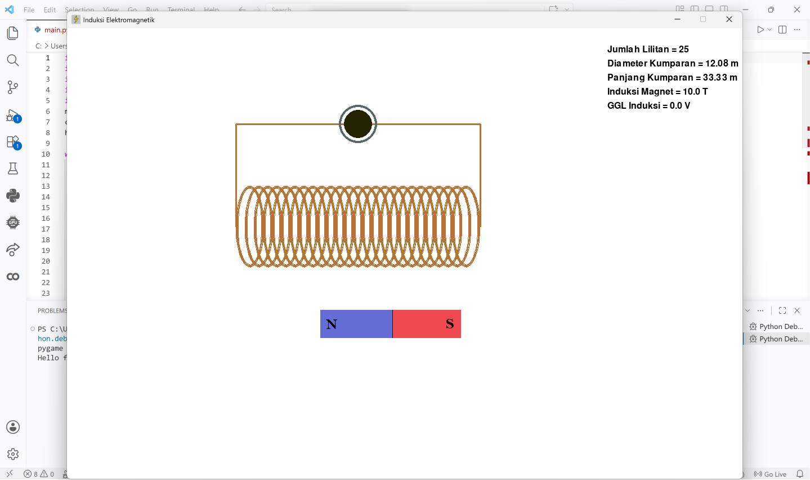
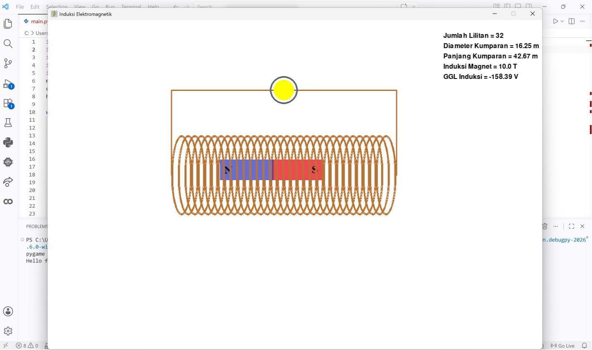
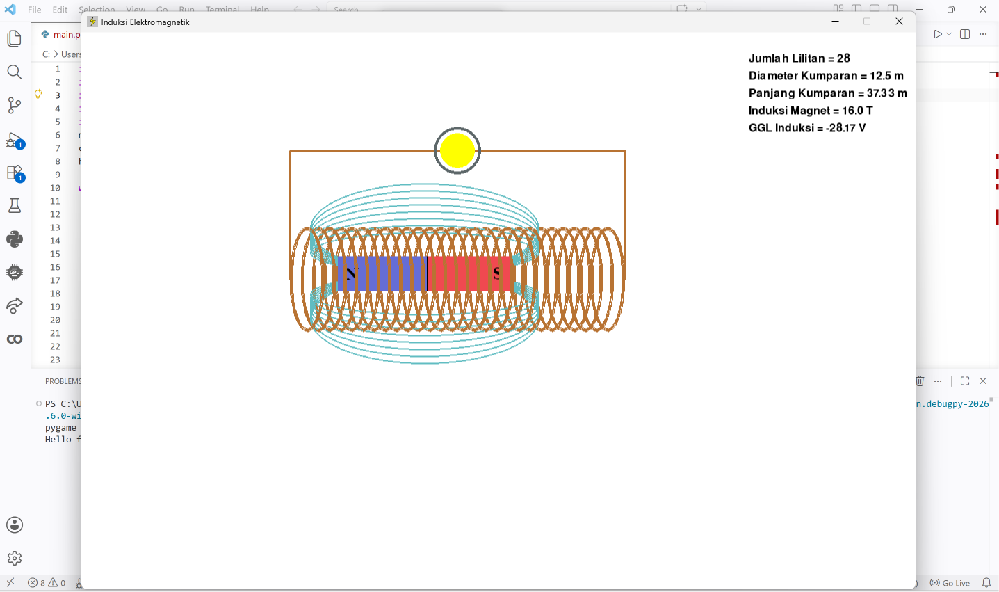
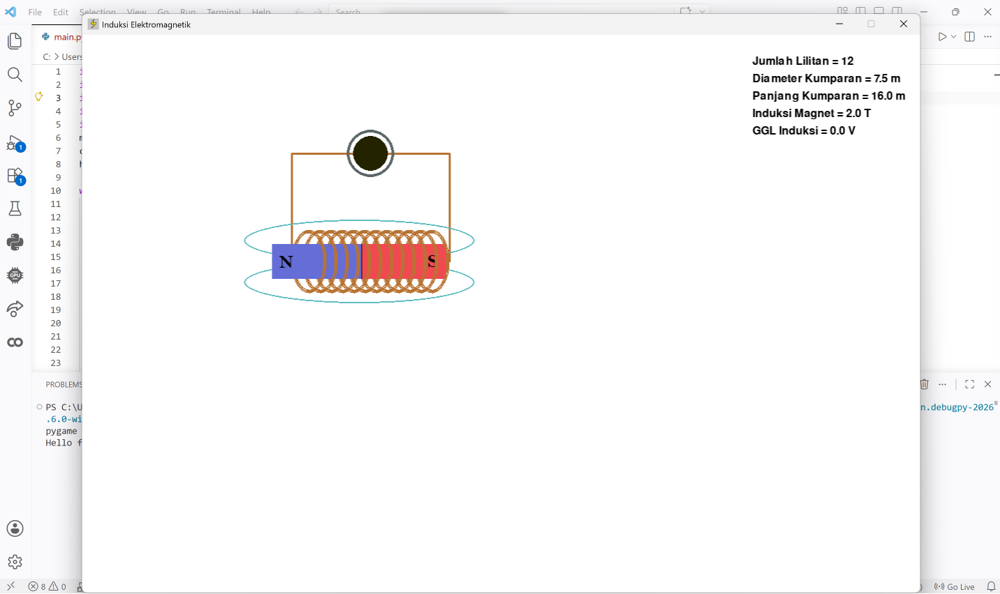

# ⚡ Electromagnetic Induction Simulator

An interactive **Pygame-based simulation of electromagnetic induction** that demonstrates **Faraday’s Law** by allowing users to move a magnet through a coil, adjust coil parameters (such as length, diameter, and number of turns), and observe real-time changes in magnetic field, induced electromotive force, and light bulb intensity

---

## 🎯 Features

* 🧲 Drag-and-drop magnet interaction
* 🔄 Real-time electromagnetic induction simulation
* 💡 Dynamic light bulb response based on induced voltage
* 🌀 Magnetic field visualization (toggleable)
* ⚙️ Adjustable parameters:

  * Magnetic field strength
  * Coil length
  * Coil diameter
  * Number of turns
    
* 📊 Real-time parameter display:

  * Number of turns
  * Coil diameter
  * Coil length
  * Magnetic induction
  * Induced electromotive force (automatically calculated)

> Note: All parameters can be adjusted by the user except the induced electromotive force (EMF), which is calculated automatically based on the simulation.

---

## 🧪 Physics Concept

This simulation demonstrates **Faraday’s Law of Electromagnetic Induction**, where a changing magnetic flux through a coil generates an induced electromotive force (EMF).

In the simulation, users can move a magnet interactively through a coil. As the magnet moves relative to the coil, the magnetic field passing through the coil changes over time. This causes the magnetic flux through the coil to vary continuously.

According to Faraday’s Law, a change in magnetic flux induces an EMF in the coil:

> A faster change in magnetic flux produces a larger induced voltage.

The simulation numerically approximates this phenomenon in real time by monitoring the magnet’s movement and calculating the resulting change in magnetic flux across the coil.

The induced EMF is then visualized using a virtual light bulb:
- Low EMF → dim light
- High EMF → brighter light

To create smoother visual feedback, the light intensity is mapped using a sigmoid-based brightness function rather than a direct linear mapping.

This project is intended as an educational visualization tool and uses a simplified numerical approximation of electromagnetic induction.

## 📐 Formulas Used

```text
Faraday's Law:
ε = -N (dΦ/dt)

Magnetic Flux:
Φ = B · A · cos(θ)

For this simulation:
θ = 0°
therefore:
Φ = B · A

Coil Area:
A = πr²

Numerical Approximation:
ε ≈ -N (ΔΦ/Δt)

Where:
ε = induced electromotive force (EMF)
N = number of coil turns
Φ = magnetic flux
B = magnetic field strength
A = coil area
θ = angle between magnetic field and coil surface normal
```

### 🧠 Explanation

* Magnetic flux (Φ) is calculated from the magnetic field (B) and the coil area (A).
* When the magnet moves relative to the coil, the magnetic flux through the coil changes over time.
* This changing flux induces an electromotive force (EMF) according to Faraday’s Law.
* The calculated EMF is mapped to the brightness of the virtual light bulb using a sigmoid function to create smoother visual feedback.

---

## 🎮 Controls

### Mouse

* Drag magnet → move magnet through coil

### Keyboard

* **F** → Show/hide magnetic field
* **W / S** → Increase / decrease magnetic induction
* **Arrow Up / Down** → Adjust coil diameter
* **Arrow Left / Right** → Change number of turns

---

## 📸 Preview

### Main Interface



### Magnetic Field Visualization, Coil Adjustment, Light Bulb Response





---

## 🗂️ Project Structure

```
electromagnetic-induction-simulator/
│── main.py
│── modules/
│   ├── classes.py
│   └── variables.py
│── pic/
│   ├── magnet.png
│   └── icon.png
│── documentation/
│── README.md
│── .gitignore
```

---

## 🚀 How to Run

1. Clone this repository

```bash
git clone https://github.com/your-username/electromagnetic-induction-simulator.git
```

2. Navigate to project folder

```bash
cd electromagnetic-induction-simulator
```

3. Install dependencies

```bash
pip install pygame
```

4. Run the program

```bash
python main.py
```

---

## 🛠️ Technologies Used

* Python
* Pygame

---

## 👤 Author

Putri Aurelia
🔗 LinkedIn: [https://www.linkedin.com/in/putri-aurelia-728abb342/](https://www.linkedin.com/in/putri-aurelia-728abb342/)

---
